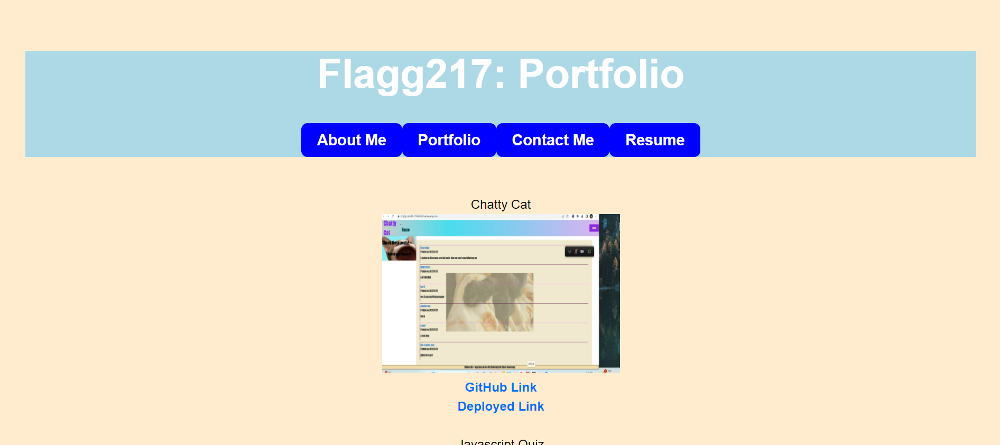

# What's Your Reaction?

## Description

This a single page portfolio application that allows users to view my portfolio, contact me, and learn more about me.

## Table of Contents

* [Installation](#installation)
* [Usage](#usage)
* [Credits](#credits)

## Installation

1. Clone the repo.
2. Open the repo in your terminal.
3. Run `npm install` to install dependencies.
4. Run `npm start` to start the application.

## Usage

Simply click on the links in the navigation bar to view the corresponding page. Click on the links in the footer to view my GitHub and LinkedIn profiles, and to send me an email.

## Credits

I had a lot of help from my tutor, my instructor, and my classmates. 

## Links

GitHub Repository: https://github.com/Flagg217/WhatsYourReaction.git  

Deployed Application: https://flagg217.github.io/WhatsYourReaction/ 
